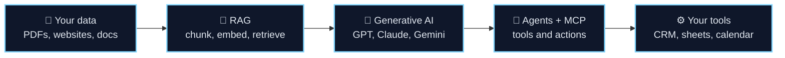
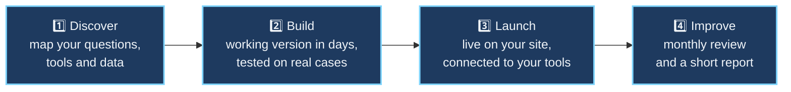

<div align="center">


<a href="https://github.com/saadmaqbooldev">
  
</a>

<br/>

<a href="mailto:saadmaqboolwork@gmail.com"></a>
<a href="https://www.linkedin.com/in/saad-maqbool-b914bb259/"></a>
<a href="mailto:saadmaqboolwork@gmail.com"></a>


</div>

<br/>

## ⚡ From Your Data to Working AI

<div align="center">

</div>



## 👋 About Me

I'm an **AI Engineer** in **Lahore, Pakistan**, focused on **Generative AI, RAG and the Model Context Protocol (MCP)**. I study **BS Computer Science at the University of Lahore (2023–2027)** and train in **PureLogics' professional Python & AI program**.

Before software, I spent **three years in e-commerce**. That's why I start every project with the business question, not the model: *where is time being wasted, and what do customers actually need?* I moved to Lahore on my own from my village to pursue this work, and I bring the same ownership to every project.

```python
class SaadMaqbool:
    role       = "AI Engineer"
    focus      = ["Generative AI", "RAG", "MCP servers", "AI agents"]
    building   = "AI assistants and integrations for small businesses"
    languages  = ["Python", "TypeScript", "JavaScript"]
    serves     = ["US", "UK", "EU", "Australia", "Canada"]
    works_in   = "your time zone for calls"

    def approach(self):
        return "Understand the workflow → build fast → test on real cases → improve monthly"
```

## 🛠️ What I Build

<table>
<tr>
<td width="50%" valign="top">

#### 🧠 Generative AI Assistants
Assistants that answer customers 24/7 from your website, PDFs and policies, with sources. They capture every enquiry and send it to your team instantly.

</td>
<td width="50%" valign="top">

#### 🔌 MCP Servers & AI Integrations
Custom MCP servers and connectors that let AI read and act inside your real tools: CRMs, databases, spreadsheets, calendars and internal APIs.

</td>
</tr>
<tr>
<td width="50%" valign="top">

#### 🤖 AI Agents & Automation
Agentic workflows for repetitive work: document intake, data extraction from PDFs, lead routing and follow-ups, with a human approving the important steps.

</td>
<td width="50%" valign="top">

#### 🌐 Full-Stack AI Products
Production-style apps with FastAPI or Node.js backends, React or Next.js frontends, auth, databases and streaming LLM responses.

</td>
</tr>
</table>

## 🔄 How I Work



## 🚀 Featured Projects

<table>
<tr>
<td width="50%" valign="top">

### 📄 [Document Intelligence](https://github.com/saadmaqbooldev/doc-intelligence)
Upload a PDF and chat with it. Built on my [LLM Chat & Document API](https://github.com/saadmaqbooldev/llm-chat-document-api): text extraction with `pdfplumber`, chunking (~500 tokens, 50 overlap) and retrieval-augmented answers.

`FastAPI` `RAG` `Anthropic API` `pdfplumber`

<a href="https://github.com/saadmaqbooldev/doc-intelligence"></a>

</td>
<td width="50%" valign="top">

### 🔌 [MCP Server](https://github.com/saadmaqbooldev/MCP-Server)
A Model Context Protocol server that gives an AI assistant real tools and resources: it can add, list, complete and delete tasks directly from a chat.

`Python` `MCP` `uv` `Agent Tooling`

<a href="https://github.com/saadmaqbooldev/MCP-Server"></a>

</td>
</tr>

<tr>
<td width="50%" valign="top">

### 🧭 [TripPilot AI](https://github.com/saadmaqbooldev/TripPilot-AI)
Full-stack AI trip planner (university capstone). Streams a 10-section itinerary grounded in **live Google Maps routing** and **real-time weather**, backed by two custom ML models for **cost forecasting** and **hotel matching**.

`React` `Node.js` `BullMQ + Redis` `GPT-4.1-mini (SSE)` `Flask` `scikit-learn`

<a href="https://github.com/saadmaqbooldev/TripPilot-AI"></a>

</td>
<td width="50%" valign="top">

### 🧠 [QuickQuiz AI](https://github.com/saadmaqbooldev/QuickQuiz-AI)
Hackathon project: paste any text and get a clear summary plus a scored multiple-choice quiz, so learners can check they actually understood it.

`FastAPI` `Pydantic` `Gemini 2.0` `Streamlit`

<a href="https://github.com/saadmaqbooldev/QuickQuiz-AI"></a>

</td>
</tr>

<tr>
<td width="50%" valign="top">

### 👥 [Crowd & Queue Analytics](https://github.com/saadmaqbooldev/Crowd-and-Analytic-YOLO)
Computer vision that detects and tracks people in video and turns it into business insight: **queue counts, wait-time estimates, service rate and density heatmaps**.

`YOLO26` `OpenCV` `Multi-Object Tracking` `Dashboard`

<a href="https://github.com/saadmaqbooldev/Crowd-and-Analytic-YOLO"></a>

</td>
<td width="50%" valign="top">

### 🛡️ [VOXA: Ransomware Detection](https://github.com/saadmaqbooldev/VOXA)
Flags ransomware in Windows `.exe` / `.dll` files **before execution**, using 23 static PE features and an **XGBoost + TabNet ensemble** with feature-level explanations. Fully offline.

`Python` `XGBoost` `TabNet` `Explainable AI` `Tests`

<a href="https://github.com/saadmaqbooldev/VOXA"></a>

</td>
</tr>
</table>

<!--
  LIVE DEMOS: when a project is deployed, add this line under its tags:
  🔗 [Live demo](https://your-link) · 🎥 [2-min video](https://your-video)

  CREDIT SENSE: add a card once the repo is public:
  ### 💳 [Credit Sense](https://github.com/saadmaqbooldev/CreditSense)
  One or two lines on what it does and who it helps.
-->

<details>
<summary><b>🚧 Currently building</b></summary>
<br/>

- 🏥 **[MediAssist Healthcare](https://github.com/saadmaqbooldev/MediAssist-Healthcare)**: AI-assisted healthcare backend for doctors. JWT auth with FastAPI + PostgreSQL is done; patient management and a local Llama 3.1 assistant (Ollama + LangChain) are in progress.
- 📇 **[CRM Project](https://github.com/saadmaqbooldev/CRM-Project-)**: TypeScript CRM for contacts, leads and deals, planned as the backend for a business MCP server.

</details>

## 🧰 Tech Stack

<div align="center">

**Generative AI & Agents**
<br/>


**Languages**
<br/>


**Machine Learning & Vision**
<br/>


**Backend, Frontend & Data**
<br/>


**Cloud & Tools**
<br/>


</div>

## 📈 Activity

<div align="center">

</div>

## 🤝 Let's Build Something

<div align="center">

**Have repetitive questions, documents or tasks that eat your team's time?**<br/>
Send me a short message about your workflow and I'll reply with how AI could help, usually within a day.

<br/>

<a href="mailto:saadmaqboolwork@gmail.com"></a>

</div>


